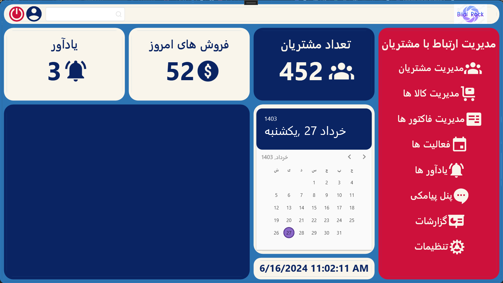
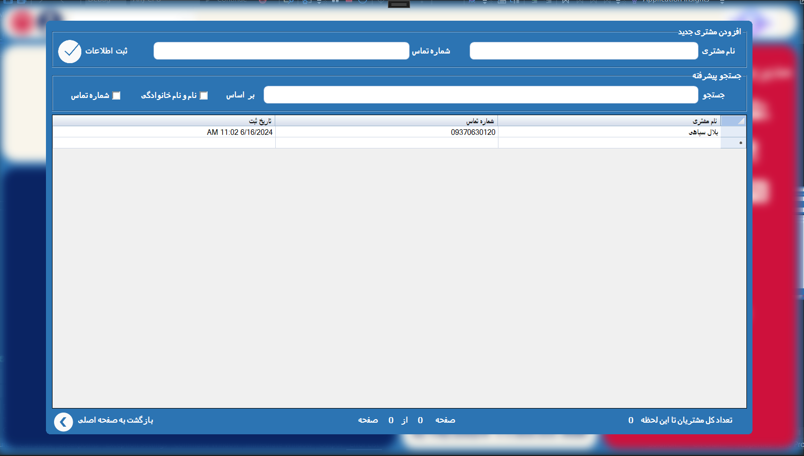
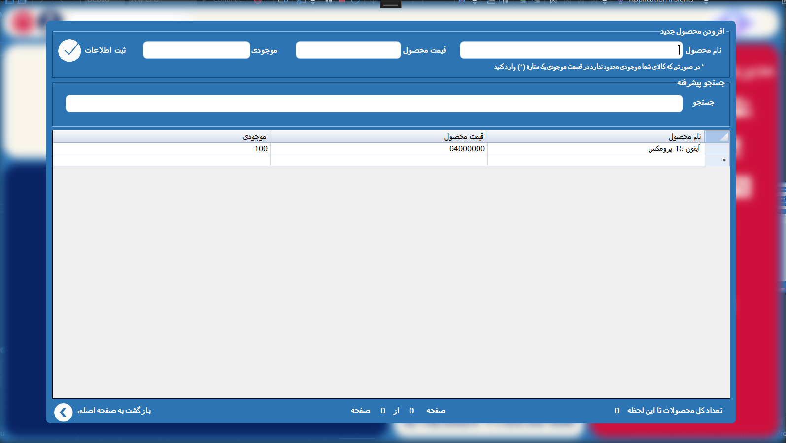
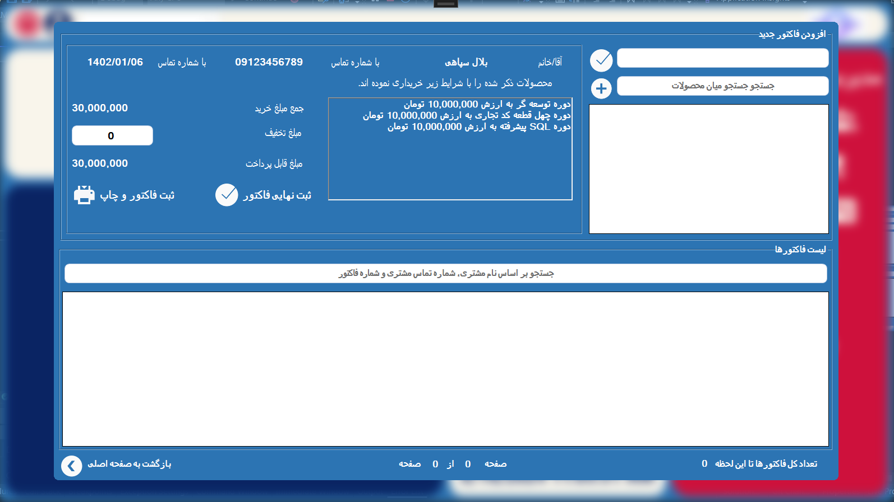
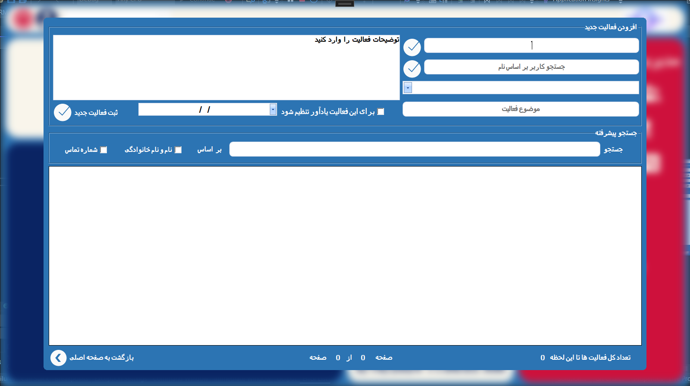
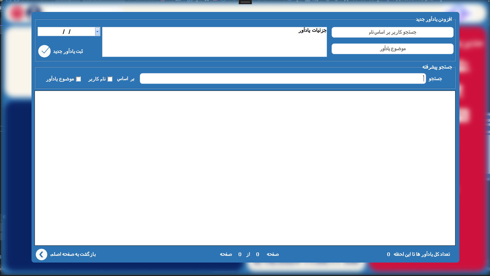
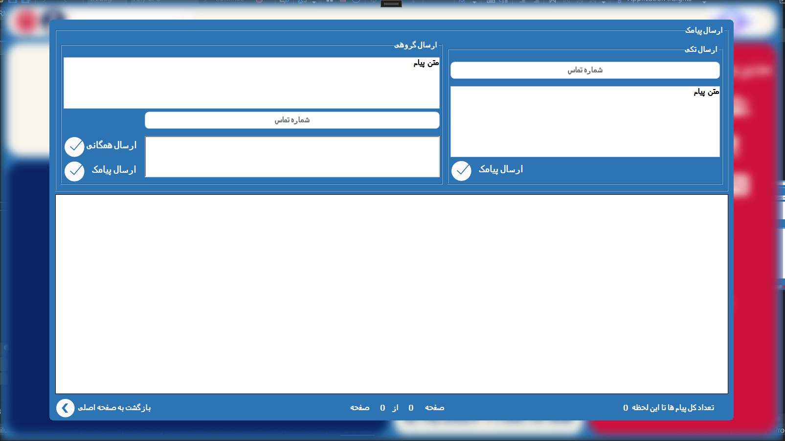

# Customer relationship management (CRM)
  <p>
    <a  target="_blank">
      </a>
  </p>
Customer relationship management (CRM) is a set of integrated, data-driven software solutions that help manage, track, and store information related to your company’s current and potential customers. By keeping this information in a centralised system, business teams have access to the insights they need, the moment they need them.

## Getting Started
* This Project is not Finished
  
These instructions will get you a copy of the project up and running on your local machine for development and testing purposes. 

### Prerequisites

What things you need to install the software 

```
Visual Studio 2022
.net 4.7.2
SQL Server
```

## Code Guide

```
3 Layer Project:

BE : Business Entity = Classes & Project Entities
BLL : Business Logic Layer = Connector between the DataBase and Project Layer 
DAL : Data Access Layer = DataBase Layer
CRMFinalProject : Presentation Layer 
```

## ScreenShots

<div>

  <p>
    <a  target="_blank">
      </a>
  </p>
  <p>
    <a  target="_blank">
      </a>
  </p>
  <p>
    <a  target="_blank">
      </a>
  </p>
  <p>
    <a  target="_blank">
      </a>
  </p>
  <p>
    <a  target="_blank">
      </a>
  </p>
  <p>
    <a  target="_blank">
      </a>
  </p>
  <p>
    <a  target="_blank">
      </a>
  </p>
</div>
